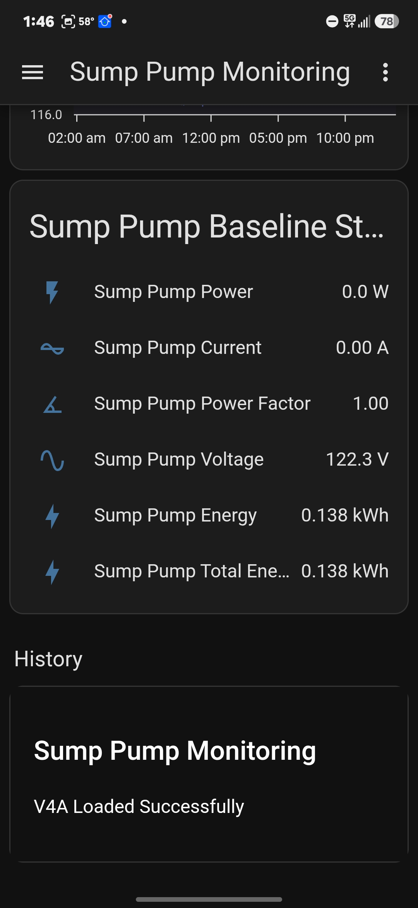

# Tug's Garage Diagnostic Card - V4A Milestone

## Date
June 15, 2026

## Objective

Create and successfully load a custom Home Assistant dashboard card written in JavaScript.

## Results

Successfully created:

```text
custom:tugs-garage-diagnostic-card
```

Loaded from:

```text
/local/tugs-garage-diagnostic-card.js
```

Verified:

- Custom resource loaded successfully
- JavaScript module recognized by Home Assistant
- Custom element registered correctly
- YAML card rendered on mobile device
- Card displayed custom content

## Test Card

```yaml
type: custom:tugs-garage-diagnostic-card
title: Sump Pump Monitoring
```

## Output

Displayed:

```text
Sump Pump Monitoring

V4A Loaded Successfully
```



## Significance

This milestone proves Tug's Garage can develop custom Home Assistant dashboard components without relying solely on third-party cards.

This opens the door for:

- Custom monitoring dashboards
- Mobile-friendly trend analysis
- Dynamic trace selection
- Predictive maintenance dashboards
- Device-specific monitoring interfaces

## Next Version

### V4B

Connect the custom card to live Home Assistant entities.

Planned features:

- Live sensor values
- Runtime statistics
- Cycle counts
- Device status indicators
- Baseline comparisons

---

Project:
Tug's Garage Diagnostic Dashboard

Version:
V4A

Status:
SUCCESSFUL
